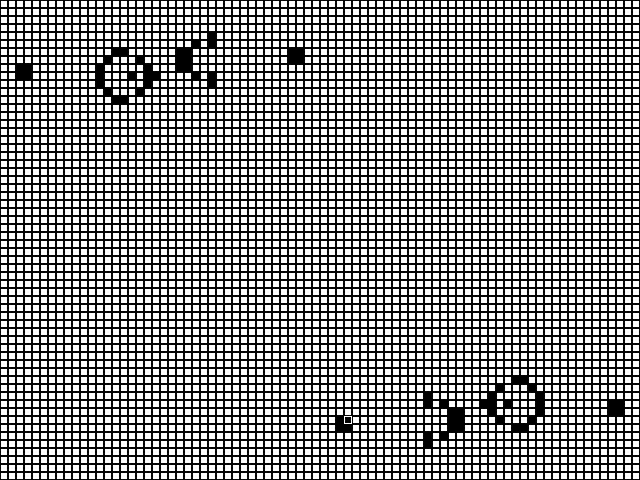

# Life

John Conway's "Life".

## About
Every cell interacts with its eight surrounding neighbours using the following rules:

1. Any live cell with two or three live neighbours survives
2. Any dead cell with three live neighbours becomes a live cell
3. All other live cells die in the next generation. Similarly, all other dead cells stay dead

## Usage
Use the cursor keys (or mouse click) to navigate the grid.
Space bar to toggle a cell on/off.
Backspace to clear the grid.
Enter to start cell generation.

Whilst the cells are generating, press Escape to return to the grid. This will reset the grid to your original cell pattern.

## Example

## Code
Written for Linux in C using the SDL2 library.
